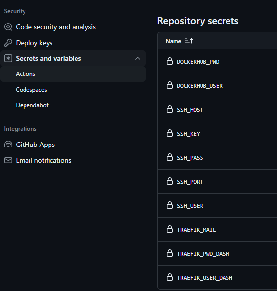

# This project was created to study containers and github actions

## Use Docker Compose for migrate virtual machines in containers

## Create secrets in GITHUB actions



### Credentials for the Docker Hub
These credentials are required to push images to docker hub
```
DOCKERHUB_USER: dockerhub user
DOCKERHUB_PWD : dockerhub password
```
### Credentials for access ssh
These credentials are required to connect for the ssh
```
SSH_HOST: 
SSH_USER:
SSH_KEY : 
```
### Variables for traefik use
These credentials are required to connect for the ssh
```
TRAEFIK_USER_DASH
TRAEFIK_PWD_DASH
TRAEFIK_MAIL:
```

# to-do


### Create a password to use on the Traefik dashboard

```
docker run --rm httpd:2.4-alpine htpasswd -nbB admin PasswordForEncrypt | sed -e s/\\$/\\$\\$/g
```